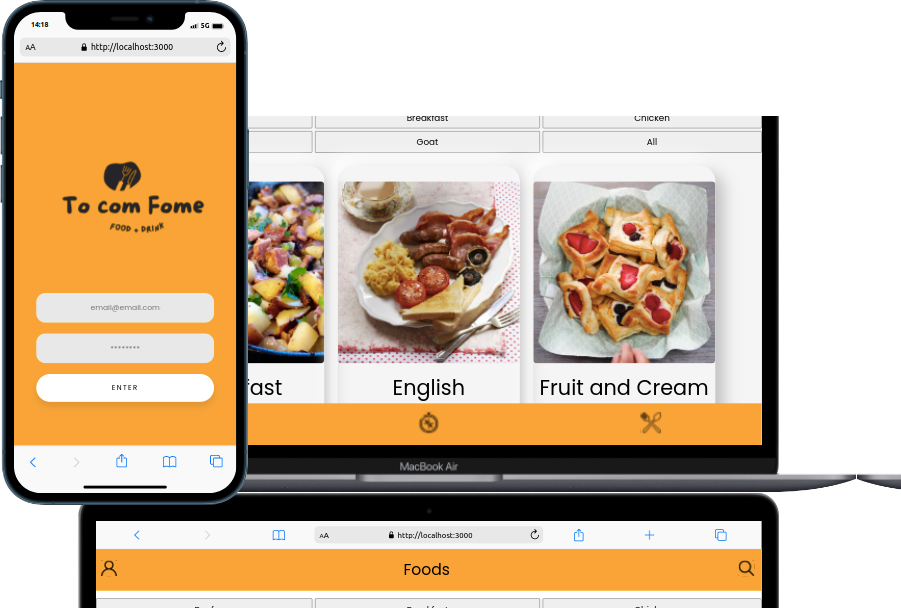

#  <h1 align="center">App de Receitas "To com Fome!"</h1>

## Projeto desenvolvido em grupo

Projeto todo desenvolvido em conjunto, utilizamos o método kanban no trello e Daily meetings para organização e definição de tasks.

Desenvolvedores:

- [Ramond Falcão](https://github.com/ramondfalcao)
- [Danillo](https://github.com/danillogoncalves)
- [Igor Leal](https://github.com/IgorHLeal)
- [Lethicia](https://github.com/Lethiciahas)
- [João Antonio](https://github.com/JoaopSilvaa)

## O que foi desenvolvido

Desenvolvemos um app de receitas, utilizando React: Redux e Hooks!

Na aplicação é possível ver, buscar, filtrar, favoritar e acompanhar o progresso de preparação de receitas e drinks!

A base de dados foram 2 APIs distintas, uma para comidas e outra para bebidas.

## Mobile First 

Mobile First é um conceito aplicado em projetos web onde o foco inicial da arquitetura e 

desenvolvimento é direcionado aos dispositivos móveis.

## 🛠 Tecnologias

As seguintes ferramentas foram usadas na construção do projeto:

- [Html](https://developer.mozilla.org/en-US/docs/Web/HTML)
- [Css](https://developer.mozilla.org/en-US/docs/Web/CSS)
- [ReactJs](https://pt-br.reactjs.org/)
- [Javascript](https://developer.mozilla.org/en-US/docs/Web/JavaScript)
- [Redux](https://redux.js.org/)

## Instruções para abrir a aplicação
[Link Da Aplicação](https://ramondfalcao.github.io/trivia-game/)

1. Clone o repositório
  * `git clone git@github.com:ramondfalcao/app-de-receitas.git`
  * Entre na pasta do repositório que você acabou de clonar:
    * `cd app-de-receitas`

2. Instale as dependências e inicialize o projeto
  * Instale as dependências:
    * `npm install`
  * Inicialize o projeto:
    * `npm start` (uma nova página deve abrir no seu navegador)
---

